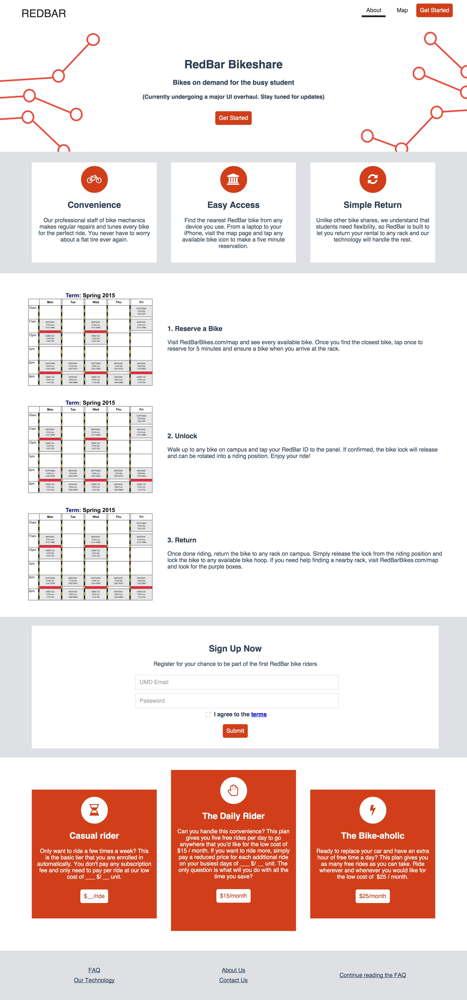
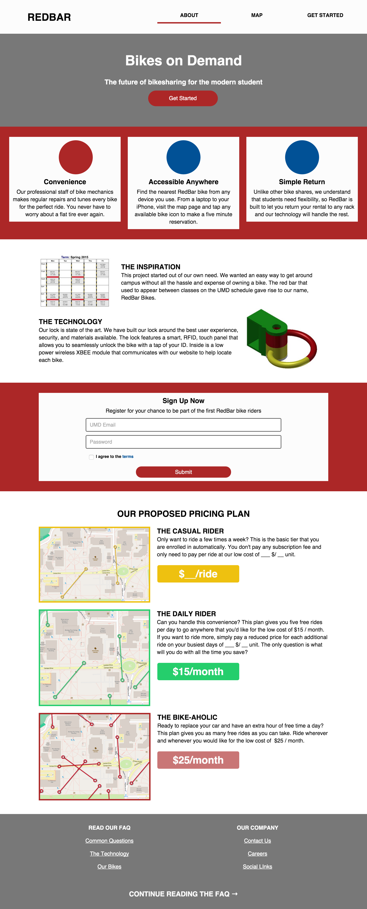
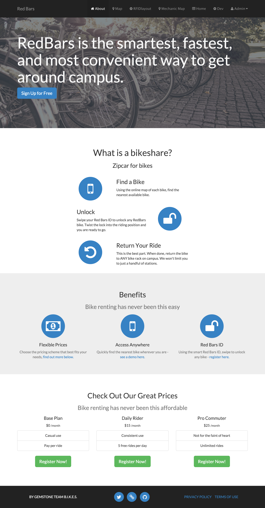

### Navigation

[Back to the home page](README.md)

[Screenshots of the Development of the Dashboard Page](Dashboard.md)

[Screenshots of the Development of Other Pages](Other.md)

###### &nbsp;

# Screenshots of the Development of the About Page

### The Current About Page:

  

### Prior Version: "*Custom*":

> First attempt at "desiging in code" rather than in a Macaw (Visual Editor) or using a template

	

### Prior Version: "*Macaw*":

> Rethinking of the about page, using an iterative approach utilizing the new software, Macaw

	

### Prior Version: "*Refined Template*":

> Based on focus group feedback, the about page was shortneed and other minor edits were implemented

	

### Prior Version: "*Template*":

> Using a template from startbootsrap, a customized about page was built as filler to be replaced later. This version was shown to our focus group and the feedback guided much of the successive development

	

### Prior Version: "*First Draft*":

> While exploring Meteor and self-teaching CSS, I built a very rough first draft of the website

<!--TODO: Get image of the first TestProject Website-->

	

The code used in this verison of the application was radically different, so I made a transition to a new repository (this one) and kept this code archived at my [testProject Repository](https://github.com/KyleKing/testProject).
