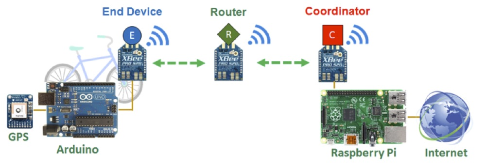
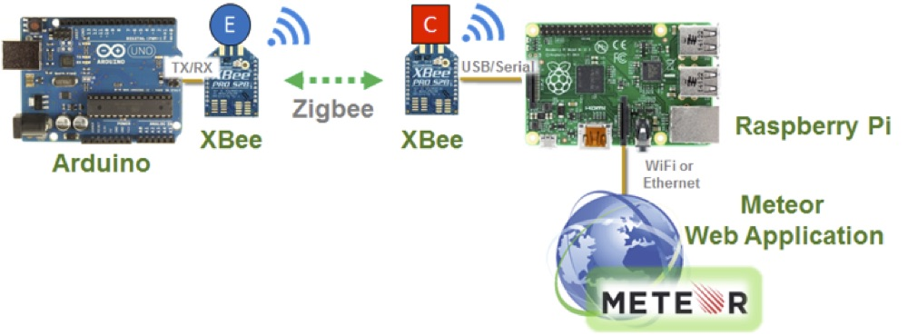
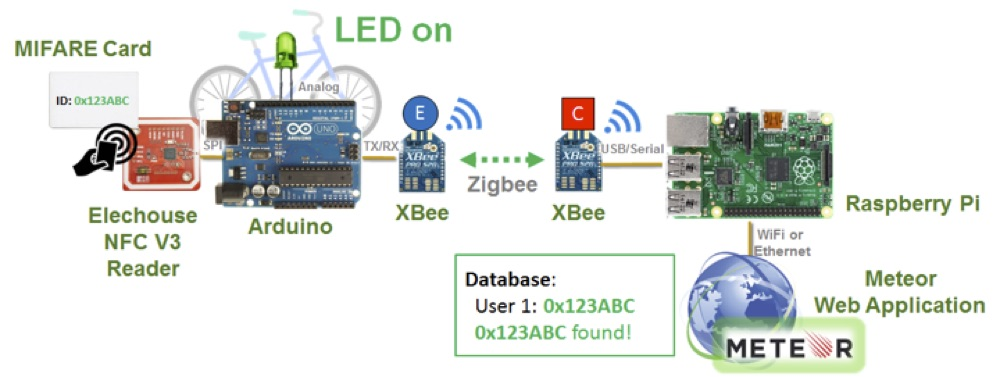
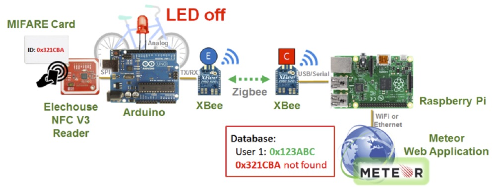
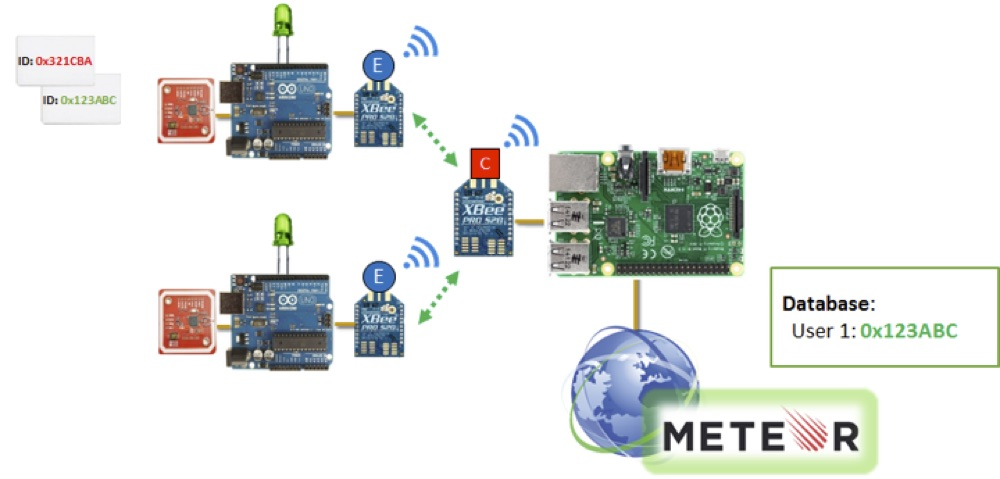
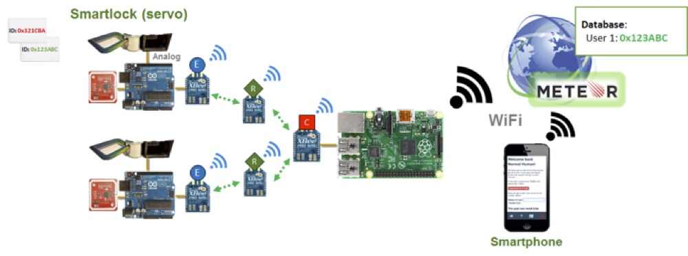

## Appendix B – System Integration Diagrams

#### ZigBee Mesh Network Components

#### Demonstration 1: Arduino to Website through XBee

#### Demonstration 2: NFC User ID Wireless Authentication

#### Demonstration 3: Multiple Smartlock Prototype Units

#### Demonstration 4: Locking and Access

