## Iteration

The iteration section addresses the evolution of the research from initial discovery into refined concepts based on user feedback.  The focus group discussion provided a majority of the feedback on the team’s experimentation.  The Locking subteam received feedback on the lock design to better accommodate the user.  The Business subteam received feedback on the type of payment that college students would find acceptable for the bikeshare.  The Access Control subteam learned the optimal placement for the NFC reader on the bike for the best user experience.  Lastly, the Geolocation subteam received feedback on the bikeshare website and what components were missing or needed improvement.

**Focus group.**  The team realized that it wanted to obtain constructive information from prospective users of a college bikeshare system.  This information would be used to better understand the process of developing and implementing a college bikeshare system.  From the participant feedback, the team gained a better grasp of the bikeshare environment on a college campus as well as developed customer requirements to compare with existing engineering characteristics in order to assist with future product generation.

The focus group discussion took place on April 30, 2015 with ten participants.  The team started with a general introduction to bikeshares and the project.  Four participants had bicycles on campus and three had used bikeshares in the past.  The Locking subteam introduced the participants to the various lock designs and gave a demonstration using a 3D printed lock, locking the bicycle to a bike rack.

The majority of the focus group discussion time was spent asking the participants questions about bicycle and bikeshare usage on campus.  The team asked if the participants would use the system on campus; three participants said yes, one said he would use it in emergencies, and another said that if the service was subscription based, yes, but if it was by a pay-per-use system, he would not.  This led the discussion into the price of current bikeshares and the price of Team BIKES’ proposed system.  When the participants were asked to guess what they thought Capital Bikeshare costs per year, they answered $80 per year and $200 per year; however, in reality, the subscription is $75 per year.  The team explained that there are many different methods of pricing, such as a flat rate per amount of time (e.g.  $75 per year, $10 per month, etc.) and charging extra if the bicycle is used over a certain amount of time.  Participants expressed concerns about a lack of knowledge by students regarding bicycles in general on the Maryland campus.  Few of the participants informed the team that they were unaware of the campus' policy that all bicycles needed to be registered with the university.  This suggests that information regarding riding bicycles on campus may not be reaching all students.  In order for the team’s bikeshare to be successful, students must first understand how it works.  To market the bikeshare, a participant suggested offering students one-time free rides as a trial experience, which could attract prospective users.  They suggested to partner with University Recreation and Wellness or Images to set up specified trails for “bike tours” with the bikeshare bicycles, allowing prospective students to try the bikeshare during orientation.  The team explained that the current plan is to follow a model similar to Sobi where there is a student rate around $25-30 per semester as well as the possibility of obtaining daily passes and unlimited riding time on campus.

An issue that was brought up during the focus group discussion was that the current plan for the bikeshare is limited to on-campus use only.  The team explained the ZigBee network limitations regarding off-campus bikeshare usage and that the purpose of the bikeshare should be to get around campus instead of getting around off-campus.  However, many participants lived off campus and expressed that their need to have a bicycle on campus is because they live off campus.

Finally, the team explained the idea of “bike deserts,” sections of the campus that may have a lack of bikeshare bicycles because students will tend to bike to certain areas over other areas.  This results in an asymmetric spread of bikeshare bicycles across campus, making it challenging for students to find bicycles if all of the bicycles have been used and left at another location.  The team’s plan is to involve the students in redistribution of bicycles at certain locations, such as the top of Stamp hill.  Participants suggested a reward system involving discounts off the bikeshare service if students move bicycles to these bike deserts.  Another participant suggested making redistribution a competition by rewarding frequent riders or hiring students as dedicated redistributors.

**_Lock feedback._**  During the focus group discussion, the team showed the participants both of the lock concepts and demonstrated the locking mechanism and concepts.  For the loop lock, the participants thought that it looked very secure and robust.  However, they expressed concern that the lock may rotate while riding and present a threat to the rider by impeding leg motion.

For the modified U-lock concept, the participants seemed very open to the design due to its close resemblance to a typical U-lock, which they were used to seeing around campus.  They also thought that the locking mechanism was reasonable, and the cable would not impede the locking motion.  However, similar to the loop lock design, the participants expressed concern over the lock impeding the pedaling motion of riders and suggested that the width of the lock be adjusted accordingly.

**_New user onboarding._**  During the focus group discussion, the team received a variety of feedback related to the website and the system operation.  The feedback focused on improving the first web page to be more informative and concise, implementing useful user features, such as a reservation system, and more clearly defining a brand identity.  Prior to the focus group, the team had created a brand using the name, RedBar.  The name was inspired by the red marks in between a student’s university schedule indicating a difficulty in arriving at a class on time, as seen in Figure 20.

Many comments from the focus group discussion addressed the “About” page or the home page shown when a user first visits the website, as shown in Figures 21 and 22.  The comments focused primarily on color scheme and visual appeal of the website, and the participants also stated that the website failed to convey the team’s unique brand.  The users additionally felt that the concept of a stationless bikeshare was not effectively communicated or explained on the first page, stating that someone outside of the focus group discussion would likely be confused.  They suggested improvements such as a visual walkthrough, diagrams, or other more general text to better accomplish this goal.  This user feedback demonstrated the user focus on onboarding and highlighted an issue found on many websites.

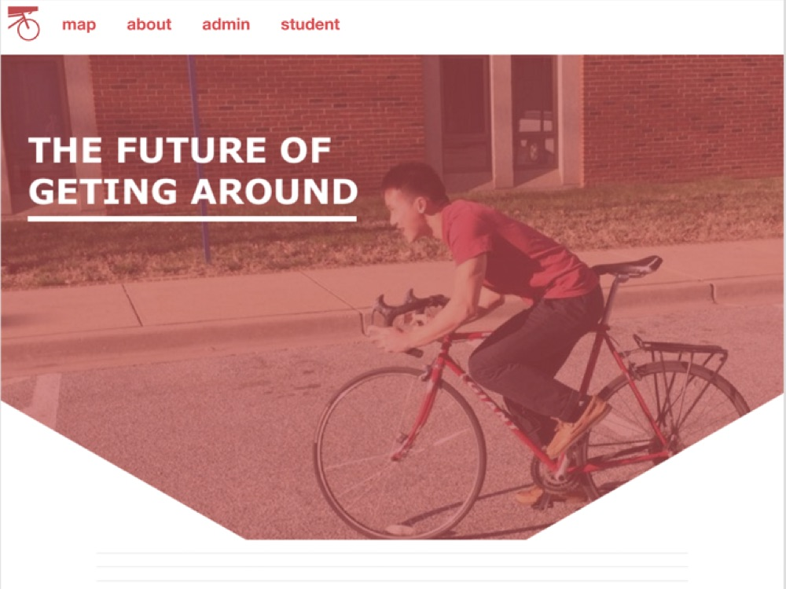

Reflecting on the feedback, the team focused on the development of better content focused towards the user needs.  First, the users wanted to understand a stationless bikeshare and what makes RedBar unique.  The revised layout reflected this change by first focusing on a clear tagline for the company: “bikes on demand for the busy student.” Second, the “About” page incorporated visual content and short, well scripted text blocks to quickly explain what a bikeshare is and to introduce RedBar.  Most of the initial content prior to the focus group discussion was removed to focus on the most crucial aspects: describing a bikeshare, explaining the value proposition, and displaying the price structure.  One of the minor issues identified by the users was the need for a more cohesive color scheme and brand.  While the team originally had a logo in the top left corner and throughout the website, the users did not recognize the brand name, so the full name, “RedBar”, was highlighted, rather than obscured through a logo.

The content removed from the “About” page would still be useful for certain use cases, such as those who wanted to learn more about the system or universities interested in implementing the RedBar system.  The information was moved to a separate series of pages focused on different use cases.  An example of this useful information is a three section callout that discussed convenience, where users would no longer need to worry about a flat tire; easy access, bikes available anywhere a user may want one; and simple return, to stress the stationless component of the team's bikeshare compared to a station-based systems, such as Capital Bikeshare.  The team additionally highlighted how the wireless communication system works, the smartlock internals, and open-source code released from this project, among other topics.

**_Interactive map._**  The focus group discussion provided feedback regarding the map, arguably the most important component of the application.  Some comments, “I like how that works” and “it is like ZipCar”, showed positive support for the direction the team was heading.  Additional comments brought up potential issues.  One comment questioned what the range was and mentioned that the map icons were not immediately intuitive.  Several comments focused on the appearance of the map and discussed the popular University of Maryland map application called TerpNav and requested a similar minimalist map tile base.  The focus group discussion members brainstormed useful features such as a nearby bike indicator that would show: “nearest bike: 5 mins from current location” or a reservation system to guarantee a bike’s availability.  The comments encompassed many components, both visual and technical, but all focused on usability.

To address the comments, the team made simple visual changes to the map tiles and icons but continued the approach to rethink the entire user interface.  Adding interactive buttons to the map tile, the team rethought the user’s interaction around a reservation feature.  The core use case was for a user to visit the website, browse for a bike in a convenient location and immediately reserve it.  Learning from the comments that the original map icons were unintuitive, the team thought about ways to make reservation interaction interactive.  Borrowing a feature already used in almost all map applications, the user can tap an icon to reserve.  To inform the user of the functionality, a proposed technique was to add a bounce indicator and notification to direct new users to the reservation process.

The reservation system proposed technical challenges along with the user experience and interface challenges.  To successfully implement this feature, there were several desirable characteristics, such as reactivity, database design, and error handling.  To accomplish reactivity, the team needed to indicate that a bike had been reserved for the user and quickly update all other users’ screens to avoid any duplicate rentals.  Additionally, all users need not be required to reserve a bike if they are within eyesight of an available bike; however, a reserved bike cannot be checked out by a user who is in the vicinity.  These contingencies helped shape the reservation system.

With the contingencies in mind, the reservation system was made non-binding.  A user would only reserve a single bike at a bike rack, but not an exact bike.  This way a user would not have to find the bike they reserved and could simply check out any bike they see.  The reservation only guarantees that a bike will be at the location specified.  So if a user, who does not have a reservation, attempts to check out a bike that would reduce the available bikes at that rack below those reserved, the walk-up user will be denied.  To provide more transparent explanation, a notification would be sent to the denied user with an explanation and link to the next nearest bike.  If however, there were an excess number of bikes beyond those reserved, the walk-up user could reserve the bike with no interruption.

To handle the error cases, the team would be able to use the non-binding component of the system.  If users attempted to reserve bikes at the same location, the application would look for an alternative bike and alert any users with an alternative.  This may arise if there is any latency in the system or a user’s connection is throttled.  While not a likely scenario, error-handling such as this is a critical feature for a robust system.  An additional time limit control needed to be placed on rentals to prevent a bike from being reserved for an infinite amount of time.  Using a Cron packaged for node.js applications, any time a rental was started the task would fire and clear the bike rental after three minutes of no action.  Additionally, all bike rentals are checked on a repeating schedule, so in case of an error, a bike can never be reserved for greater than half an hour.

**_Critical Feedback._**  Not all features were received positively.  One such feature, a fitness component tied to each user’s account would have shown data for the length of a ride, vertical climb, and average speed for each user.  The Geolocation subteam imagined this as a fitness tracker and a way for users to receive additional value from the system; however, few focus group discussion members expressed any interest in the feature and most saw it as an unnecessary feature.  This was a useful lesson in privacy and the interest in college users to maintain some level of anonymity.

**_User interface philosophy._**  The feedback from the focus group helped define a general user interface philosophy to unite and focus the web application’s development.  Based on feedback from the focus group, it became apparent that building fast was not the only metric for success.  Instead, the Geolocation subteam gained a finessed and refined understanding of user needs and product development for usability and experience.  With this new knowledge the constraints changed.  First, the team realized that greater focus needed to revolve around product design to deliver a clear user interface that users could easily understand and interact with naturally.  Second, the team needed to focus on minimalism by reducing the bloat of pages, the number of scripts, and removing unnecessary content.  Finally, the team learned that users would use both desktop and mobile devices, so the website needed to scale responsively on all platforms.

To deliver on the first priority, product design and branding, the Geolocation subteam invested the time to overhaul the about page and rethink the initial user experience.  The lessons learned from this overhaul and subsequent custom stylesheet process from Macaw to Stylus, laid the groundwork for subsequent overhauls on the admin and employee pages.  For the second priority of minimalism, the Geolocation subteam aspired to reduce the number of tabs, links, and pages across the application.  For the about page, the Geolocation subteam reduced much of the content on the page and created additional pages with focused content tailored to specific use cases.  Additionally, based on feedback received from the focus group, the Geolocation subteam began minimizing the number of pages needed to create an administrator’s experience.  Narrowing down to a single page, the admin can scroll past several graphs of highlighted data before viewing the detailed data of each bike.  From the tables, the administrator can sort, search, and open in-depth panels that explore the bike information in greater detail.  To accomplish the third priority of responsive styling, the Geolocation subteam focused on creating unified elements between mobile and desktop, while emphasizing the core features that were expected in each.  For example, on mobile, users are accustomed to native applications offering a horizontal navigation bar that can quickly link the user between the minimalist set of three pages (for a user), while on desktop, a top-fixed navigation is more common.  The core content of the application is thus consistent between mobile and desktop.  The sliding panels that allow for in-depth analysis on the admin pages are identical on mobile.

**_Visual development pipeline._**  Prior to the focus group discussion, the Geolocation subteam relied on the Foundation framework, but found the framework too visually constrictive and instead opted for the more mature framework, Bootstrap.  To further gain visual freedom and avoid conflicts, the Geolocation subteam selected components from Bootstrap while building custom CSS elements in parallel, rather than writing workarounds to override the Bootstrap enforced styles.  To make this possible, the Geolocation subteam adapted open-source code to make a customizable version of Bootstrap available to Meteor as a complete package.  The package worked by collecting user preferences through a JSON configuration file, parsed components from the large Bootstrap-Stylus GitHub repo, and selected which code blocks would be written to a file inside the user’s local meteor directory.  This package proved exceedingly useful for rapid website prototyping and was released under the name: “kyleking:customizable-bootstrap-stylus” and has over 145 users - available open-source at https://atmospherejs.com/kyleking/customizable-bootstrap-stylus.

Utilizing the experience gained from developing version of the site in Foundation, Bourbon, and Bootstrap, listening to user feedback on the about page, and researching the design of similar company websites, the Geolocation subteam establish a clear brand identity and create custom stylesheets.  To accelerate the development, the Geolocation subteam used Macaw, an application that allows a website to be built with an interactive user interface (UI) and scalable code to be generated on demand rather than developing the code with a text editor.  This UI-first process was beneficial in quickly iterating through visual prototypes by mocking the user interface, sample text, images, and output functional code with proper CSS classes.  Additionally, breakpoints could be set to demonstrate how the UI elements would cascade on different browser sizes from desktop to mobile.  At different browser widths or breakpoints, the elements would have a new style, such as 100% width on mobile screens, vs.  33% width on desktop computer screens.

From this information, Macaw would create CSS code, but needed additional processing to be incorporated into a Meteor application.  First, the static assets and pictures must to be moved to the special Meteor, “public” directory inside of an “img” directory as specified by Macaw in the exported HTML files.  Second, the HTML code needed to be appended in <template> tags and added to the application’s client folder and routing tool to be incorporated into Meteor’s rendering system.  Likewise, any HTML headers needed to be removed to avoid conflict with the default header set elsewhere in the app and the doctype set by meteor.  Third, the javascript files exported by Macaw had to be wrapped in template rendered blocks to prevent interference with other web pages.  Upon each new iteration of the design, only the CSS, style files and inner HTML content needed to be updated.  This workflow liberated the team from spending countless time manually building the website’s component, while allowing the subteam to establish a visual identity and highly accessible web application.

After the completion of the Macaw design phase, the code needed considerable refactoring to both port the code into one of the stylus and jade pre-processors and to refactor the code for meaningful editing.  The former is easy to do with an online tool js2coffee or the HTML2Jade Converter, while the latter takes greater manual input.  Although the refactoring step is redundant because the code was created in Macaw, it has a faster workflow, allows for a greater number of iterations inside Macaw, is better organized, and is more concise than if written from scratch.  This process is faster and allows for a greater number of iterations.  Once refactored, the code is ready to be manually edited from text file with ease, with simple variable changes or quick edits to concise components.

**_Restricting access through roles._**  To develop security and prevent users from accessing another's data, or worse, the public accessing user data, the Geolocation subteam implemented a role-based authentication system.  This system was first applicable to the map application.  In order to reserve a bike, a website visitor must be logged in and in the “user” role.  If a visitor does not meet the requirements and clicks to reserve a bike, the request is denied and a UI alert appears.  The use of the “user” role simplifies account management.  An alternative approach would be to provide individual exceptions for each user.  However, the role-system allows for user-base wide changes to be made in a controlled and intuitive fashion to clearly defined roles.  Another application of roles serves to provide administrators sufficient access, when necessary.  The “admin” role provides access to information including personally identifiable information and would only be used to contact a user, such as in the event a bike is stolen and the user is the last known user.  Staff like a mechanic have the “employee” role and have complete access to the inventory of bikes including those available or in need of repair.  The role-based system provides a sane way of managing a complex and potentially shifting backend.

**Implementation.**  Incorporating the focus group feedback, each technical aspect of the system was further developed.  The lock design was altered to increase user friendliness and reduce manufacturing costs without compromising security.  The lock design also incorporated design changes to accommodate the electric systems inside the attached box.  The NFC reader deemed best fit for the intended smartlock access control system was determined.  Moving forward, the wireless sensor network was further tested in order to find the best method of communicating through the XBee modules.  Data was also collected on the range of the individual modules to provide information on how to smartly place the routers in the final system design.

**Evolution of the modified U-lock.**  In parallel with the loop lock, Team BIKES decided to develop a bike lock that was based on a U-lock, the current safety standard recommended by DOTS at the University of Maryland.  Therefore, the design incorporates the structural integrity of the U-lock with a solid loop enclosure.  However, the conventional U-lock separates into two parts when opened, which is not desirable in a bikeshare system because detachable parts can be easily taken or lost.  As a result, a cable extension connecting the loop enclosure and the lock base is proposed to allow for flexibility during locking while also keeping the whole lock a single system.  The lock relies on a reel system to ensure security of the cable and for improved usability.

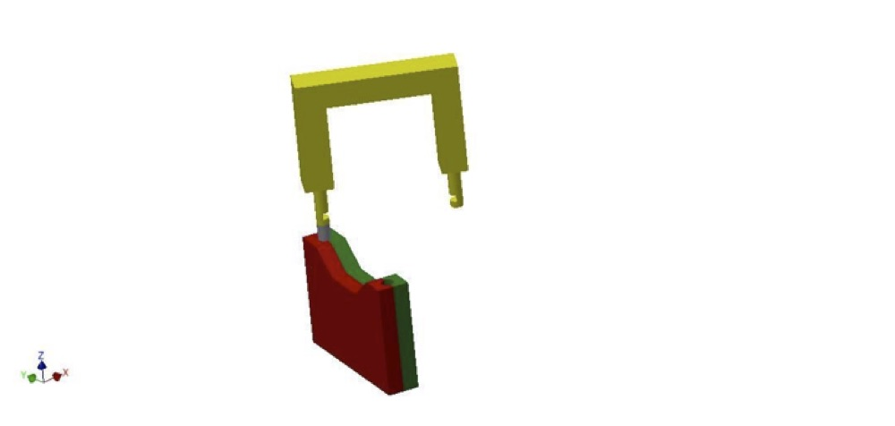

The first iteration, as shown in Figure 23, was used to gauge the shape of the locking mechanism and whether a retractable pin mechanism would work correctly.  Through FEA analysis, the team found that the design would withstand a reasonable range of forces.  After rapid prototyping, Team BIKES demonstrated the feasibility of the lock design and novel locking mechanism.  The locking mechanism consisted of two pins that were angled on one side and pushed into a locking position using a spring mechanism.  When retracted by a motor, the lock could easily be unlocked, but in the normal, passive state, the pins would prevent unwanted access, when the U-portion of the lock was re-inserted.  The pins allowed for minimal electronic interaction, which creates less power draw and longer battery life.  This prototype also led to the discovery that the cable connection between the loop enclosure and the lock housing had to be longer in order to provide proper flexibility during locking.

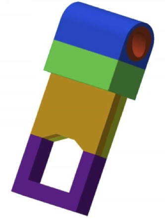

The second iteration of the modified U-lock, as shown in Figure 24, involved incorporating an electronics housing unit on top of the locking mechanism to allow for close electronics integration.  After an additional round of additive manufacturing prototyping, the team learned that the overall size would possibly restrict the cycling motion of the rider.  Since the initial placement of the lock was in the crux between the toptube and downtube of the bike, the location coupled with the size of the lock could result in undesired contact with the biker’s legs.  The team also concluded that since the top tube of the Fuji bike being used for research is curved, it would be difficult to create a proper mount for the lock.  Due to all of these factors, the team realized that it would need to relocate the lock on the bike to allow for optimal performance.  The relocation of the lock meant that the mechanism attaching the lock to the bike had to change.  Since the shape of the rear stays differ from bike to bike, the team first made a 2D prototype of the curvature of the rear stays of the particular Fuji bike selected.  The choice to 3D print a 2D model enabled faster prototyping and minimized excess material use.

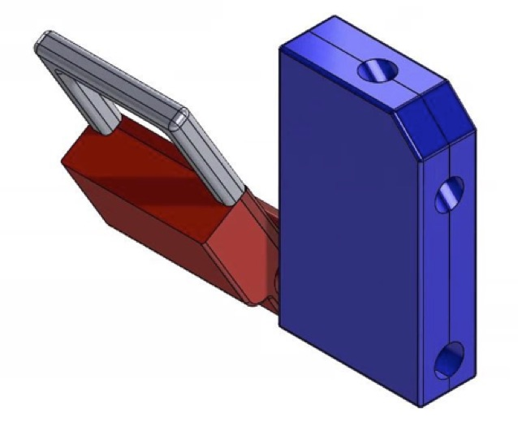

The third iteration of the lock, as shown in Figure 25, included the relocation to the back of the bike, opposite of the drivetrain.  This location was selected to avoid interfering with the rider, have the least effect on the balance of the bike, and ensure proper locking technique.  The electronics housing box would be secured to the rear, non-drive seat stay and had a concealed shaft to the locking component so that electronic components were exposed.  Ultimately, the lock had potential as a stationless bikeshare smartlock, but was not selected due to many intricate features that would be hard to manufacture and easily exploited by bike thieves.

**Evolution of loop lock.**  During early stages of research, Team BIKES pursued lock designs that had limited use for individual users, but could be adapted as part of a bikeshare system.  The team targeted designs that could not be removed from the bike and locking mechanisms that could not be directly interacted with.  During this research stage, the team settled on a design similar to a handcuff.  The circular tubes reduce stress concentrations and are notoriously harder to bend than square or other angled shapes.

The first iteration depended heavily on the use of two hinges, as seen in the left print in Figure 26.  These hinges were oversized to compensate for their inherent weakness.  Through FEA analysis and functional testing by means of additive manufacturing prototyping, this design was deemed non-functional.  The hinges were of great concern as they were weak to torsion and required complex machining.  The hinged loop also limited the type of bike racks the lock would fit around.  In addition, the hinge pins posed a safety concern in that each pin needed to be permanent or a potential thief could simply remove the pins, rendering the lock ineffective.  There was little confidence in the safety that this design could provide, therefore the concept was reworked for the next generation.

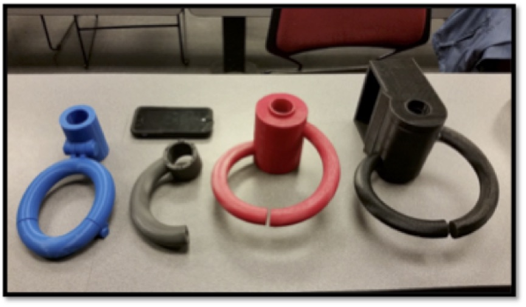

The second iteration, the middle print in Figure 26, introduced a rotating collar design.  The lock was designed in two halves, each with half of the locking loop. This concept was maintained in future iteration, as seen in the right print in Figure 26.  Each half had a large metal cylindrical collar that would fit over a bike seat post and a half loop welded onto the side.  The second iteration used thin collar walls with thin vertical pins as the locking mechanism.  While the design considerably improved from the first to second iteration, the team recognized the need for stronger pins and collars to meet the stringent security goals set by comparable bike lock manufacturers.

The third iteration of the loop lock concept, the right print in Figure 26, involved a much sturdier design than iteration two.  The upper collar has a welded shaft that acts as a center post for the lower collar to rotate around.  Two caps are welded on top and bottom to keep both collars together and to allow a release mechanism to be safely contained within the lock housing.  This design is the direct precursor to iteration four.

The fourth iteration, depicted in Figure 27 below, is improved from the third iteration with practical design changes and a housing unit for on-board electronics.  Each collar thickness is increased to accommodate four steel pins and 4 matched teeth with channels to prevent over-rotation of collars.  The teeth on the lower collar (pictured in yellow) mate to channels in the upper collar (pictured in red) to limit the rotation and prevent users from locking the collars in the “open” position.  The open position is when the tips of the collars are separated allowing the lock to go around a bike rack.  The closed position is when the arm tips are nearly touching and the locking pin has secured the lock shut.  Four steel pins are loaded into their respective shafts near the teeth.  One end of each pin housing contains a spring to force the pins into the locked position when the system does not actively call it open.  The passively locked pin-system conserves system power so that no actuation or sensor is necessary to lock the collars.  In the event of system power loss, the system will stay in its locked state and prevents would-be thieves from simply opening the collars.  Moreover, the flex in each loop is minimal enough to prevent the lock from being pulled far enough apart to be slid off of a bike rack.  The lower collar additionally has drain holes through the entire collar to prevent moisture buildup, which would interfere with the pin operation.  This welded ring on the underside secures the lower collar to the upper one and prevents disassembly.  The fourth iteration does not allow access to the internal pins and springs once assembled.

The fourth iteration includes an attached electronics housing.  The electronics housing contains two bolts that are inserted from the inside of the housing into the upper collar.  There are two holes on the same face of the housing that align with the lower collar that contain spring loaded contacts in order to tell if the lock is open.  An inlaid conductive strip in the lower collar will complete a circuit to inform the software if the lock is in the closed position.  The top of this housing has access to the top of the upper collars in order to attach actuators that recess the locking pins and allow the collars to rotate and open.

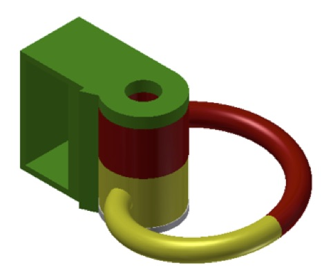

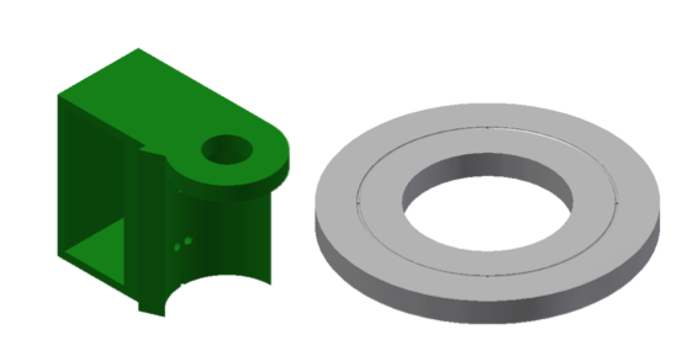

Lower welded ring (right).  Drain holes prevent liquid and particulate buildup inside lacking mechanism.

The fourth iteration of the loop lock prototype was also 3D printed, allowing the team to integrate electronics into the device and test the system as a whole.  The team corrected bugs in the control program and modified the lock design to improve quality and function.  For example, concentric circle tolerances were enlarged to permit smoother rotation and quicker assembly during production.  Several edges were chamfered for ease of assembly and user comfort.  In future prototypes, the team intends to manufacture aluminum locks for more accurate testing; this model would also be implemented in a scale study to test the user experience of the lock.  The team would start with aluminum due to the cost of material and material softness.  Aluminum is softer than steel, therefore simpler to machine.  After the aluminum lock is tested and modified, the team would then manufacture prototypes in steel minimizing the needed revisions, thus saving manufacturing time and cost.  The steel locks would require professional assistance welds so that the welded bonds are not inherently weak due to poor workmanship.  These steel prototypes would be failure tested in order to confirm the FEA failure results and ensure the effectiveness of the lock.

Immediately after each stage of design, the team performed FEA analysis.  By performing this analysis, the team could make modifications to maintain strength and predict failure points.  Since prototypes are expensive and time consuming, it is ideal to create digital models prior to manufacturing to eliminate as many faults as possible.  During failure testing, it is also important to predict where failure will occur in order to focus the study on that area.  Studying the failure point can provide insight into the type of break, what types of forces would cause the break, and methods for design improvements to prevent subsequent failures.

To increase manufacturability, the design was adjusted a final time resulting in iteration five.  The major differences between this iteration compared to previous versions is the shape of the locking arms, the method of pinning the lock closed, and the method of attaching the electronics box to the rest of the lock.  The locking arms are no longer semicircles due to manufacturability issues and have been changed to straight rod arms with a 90-degree bend.  This bend has minimal effects on the strength of the arm, but increases the manufacturability of the lock.  Further, the fifth iteration no longer has nubs and pins between the layers of the collars.  Instead, the method of locking is a single large pin that extends from within the electronics box, through the support beam that holds the lock together, and into the upper collar.  The lower collar is held in place because it is sandwiched between the pinned upper collar and the immobile electronics box and therefore cannot rotate in any direction.

The electronics box will be constructed out of sheet metal and folded into the desired configuration.  The folded material will effectively protect the housed electronics from weather and tampering.  A structural member of the lock and the locking pin itself pass through the box to maximize difficulty of removing the electronics from the locking mechanism.  To prevent the lock from rotating while users are riding the bike, there will be three shafts with ball and spring assemblies.  The concept is very similar to the dials in a car console in that the dial stays in a particular position until enough force is applied to move to the next position.  The lock will have a similar system so that the lock only moves when the user needs it to move.  These shafts will occur in the top and bottom collars to prevent either collar from rotating.  Both collars will be constructed identically in every respect so that instead of manufacturing two separate collars and requiring extra infrastructure, only one design will be required.  There will be no discernible top or bottom collar during lock assembly.

The sixth and final iteration, pictured in Figure 30, refines some of the finer details from the previous iteration.  The locking method with a single pin has stayed the same.  The locking arms are still being bent at 90-degree bend and welded into the collar, and the collars will both be identical to improve manufacturing efficiency.  The electronics box is still folded sheet metal that will be welded together at the edges to protect the electronics.  The pin housing is welded to the top of the electronics box depicted in Figure 31, which contains the pin, a spring system, and a servo to actuate the pin.  The pin is a simple cylinder with a slot through the side as shown in Figure 32; this slot is where the servo arm moves through to open the lock.  To conserve power, the servo is only powered when actuating, so a spring is mounted to push the pin to the locked position.  To hold the lock in the open position during riding, each collar has three sets of neodymium magnets that hold the lock in the riding position with the locking arms straight back to prevent the rider from hitting the arms.

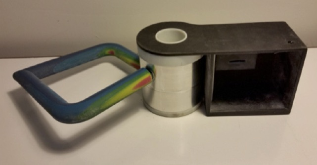

**NFC reader selection.**  The Elechouse NFC Module V3 was selected as the NFC reader for the smartlock prototype.  The selected model provided similar functionalities to the model tested, but stood out due to the detached antennae that would best fit inside tight smartlock electronics housing.  The NFC shields with attached antennas impose the restriction that the NFC shield itself, pinned to the microcontroller, must be in close proximity to the user access control interface.  Due to the Elechouse NFC reader’s antenna configuration, the user access interface could be physically isolated from the other electronics.  Figure 33 illustrates a possible system architecture using the Elechouse NFC Module V3 and the MIFARE smart card.

**Hardware-Software co-development.** As new hardware modules were added to the system, the code base used to respond to these modules was updated. When system development began, the functionality programmed onto the Arduino was limited to reading a MIFARE smartcard and reporting the card’s ID via a serial monitor on connected computer. The next hardware addition was a small push button used to simulate a user activating the lock’s electronics by pressing a sensor. The pushbutton was connected to one of the Arduino Uno’s interrupt capable pins, and in software a rising-edge interrupt was enabled for this pin. As a result, when the push button is depressed, a connection across the legs of the push button is formed and this results in a logically HIGH voltage level being observed by the interrupt enabled pin and this triggers a specific software function. After adding the interrupt functionality, it became necessary to develop a more formal structure for the code running on the Arduino so that user interaction and required error checking mechanisms could be simulated.

The code was organized into several states that represented potential system conditions. The states and the functionality each performs are specified below in the order in which they would be reached under normal operation. Note, each state contains a specific mechanism for moving to either the subsequent state or the general error checking state.

  * **Not Reading**- This is the idle state from which the process of verifying a user begins. The next state is accessed when a user presses the activation button.
  * **Reading**- During this state, the reader attempts to read from an NFC tag. The maximum length of time that the Arduino can operate in this state is limited for the sake of power savings. The NFC reader’s power draw is significantly higher when it is actively attempting to read a tag.
  * **Read**- Upon successfully capturing the ID from an NFC tag during the “Reading” state, this state seeks to verify if it is a valid ID. It broadcasts the tag ID, and waits to receive a signal confirming or denying the tag. If the tag ID is approved, the next state is “Open”, otherwise it is “Not Reading.”
  * **Open**- This is the state that triggers the motor to open the locking mechanism in the final system, so to model this motion, a small servo is rotated 180 degrees once this state is reached. The transition to the “Closed” state occurs after a button press is registered by the same hardware interrupt used to activate the “Reading” stage to simulate the final closing of the lock when a user has re-locked the bike after riding it to a new location.
  * **Closed**- In this state a message is broadcast that contains the ending location of the bicycle.
  * **Error Checking**- This state is entered if the Arduino cannot connect to one of the attached components, including the NFC reader, GPS or Xbee module. This state forces the Arduino to attempt to reconnect to the missing component until the connection is once again secured.

Once these states were defined, the general structure of the code was left intact, and the only changes made concerned the exact sources of the data that each state is responsible for. The first example of this is the Xbee communication. During initial prototyping stages, the “Read” and “Closed” states simply reported the NFC tag and ‘location’ respectively via a serial monitor and waited for responses from the serial input provided by team members. Once the Zigbee communication and web server back end were developed, these states sent and received information via an Xbee end device connected to the Arduino and the web server responded in real time to the requests sent by these states. Likewise, upon the integration of the Adafruit Ultimate GPS Breakout module, the location information sent to the server was based on actual GPS data. The development of a clear, expected progression of communication between the system and other entities was necessary because in the final design, the entire system was powered using a 600 mAh rechargeable battery in lieu of a wired connection to computer, as used during development. This removes the serial monitor as a debugging tool for the system, so it is imperative that code progress reliably between the states with appropriate tangible effects, such as the turning of a servo or a record of data received by the servo.

**XBee network progress.**  The techniques for interfacing with the XBee modules went through several iterations. The first iteration involved byte-by-byte communication through multiple XBees configured in the AT mode.  The XBee modules’ pins were made accessible for prototyping by connecting them to breakout boards and then an Arduino.  Initially, the integration between the Arduino and XBee modules was done in the simplest form: using two AT modules with one as the coordinator and another as an end device.  Once the XBee modules were configured as such, the non-coordinator XBee was wired to the Arduino, matching the TX pin of one with the RX pin of the other and vice versa.  The other module was connected via USB to a computer running the XCTU application with the terminal tab of the application open to allow for serial communications.  Within the application, a packet was created as a simple test string: “Hello, world!” Sending the string resulted in the “Hello, world!” message being received by the Arduino’s serial monitor.

The second iteration had both modules connected to Arduinos.  When messages were sent from one Arduino’s serial monitor to the others, the data was transmitted byte-by-byte.  This messaging format made receiving the transmissions more difficult to handle due to the possibility of messages from separate XBees becoming interpolated.  To solve the byte-by-byte communication shortcomings, the team explored several of the XBee features regarding pin-specific communications.  An XBee module was configured to send data over a specific pin on the board, and then an Arduino digital output pin was wired into the XBee pin configured for data transmission.  On the coordinator side, the reading was then received in the XCTU application, proving that this technique would work for one-way, binary data.

A shortcoming of the digital read was that the data size would be limited.  In order to include more information from the bike-side of the network, the team explored the analog read feature.  The XBee modules were configured to be able to send analog data over a specific pin, and the data was received on the coordinator side in the XCTU application.  The transition from digital to analog allowed for more data to be read in a single transmission.  However, since there were fewer analog pins than digital pins the size of the data that could be transferred was limited.  Furthermore, the analog pins were only capable of one-way communications, so there was still a need to develop a way for the coordinator to send data to the end devices.

To solve the one-way communications issue that existed in the past two experiments, the digital command XBee feature was explored.  Using this feature, the coordinator could send a digital HIGH or LOW to a specific pin on the end device.  This digital command would suffice for simple yes/no responses, but more pins would need to be used in order to send more than just a 1 or 0.  Also, for each command sent down to the end device, an additional command would need to be sent to return the pin to the original state.  As a results of the need for multiple messages and the lack of an ability to send more than a 1 or 0, another technique for data transmission from the coordinator to the end devices was needed.

The solution to the above shortcomings came in the form of mix and matching firmware of the XBees and sending data in a string format.  The routers and end devices were configured in AT mode, and the coordinator was configured in API mode.  Recall, in AT mode, the Arduinos were receiving the messages byte-by-byte.  When the coordinator is set up in API mode, the coordinator end of the system handles this issue by receiving the string within a single packet.  This technique allowed the routers and end devices to simply send a string through an AT mode XBee and have the transmission received as a single packet on the coordinator side, which eliminates the interpolation issue described earlier.

To communicate in the other direction, the coordinator wraps a single byte into a transmit request ZigBee packet and sends it back down to the end device.  The AT mode end device then receives the message, which was formatted as a single byte intentionally and can then be interpreted however the protocol on the Arduino decides.  Note that if the transmission was any more than a single byte, the byte-by-byte issue would arise, thus requiring a smarter receive protocol on the Arduino.  With the single byte, the options increase from the previous two options of 1 or 0 to 255 options.

After iterating through multiple techniques for methods of communications with the XBee modules, network testing was performed.  To test simple network configurations with various node types, the XBees were configured to transmit empty packets from various numbers of routers and end devices back to a single coordinator, pictured in Figure 34.  The packets were seen with a serial monitor on the coordinator.  By analyzing the MAC addresses of each packet, it was confirmed that all of the network configurations below were functional, depicted in Figure 35.

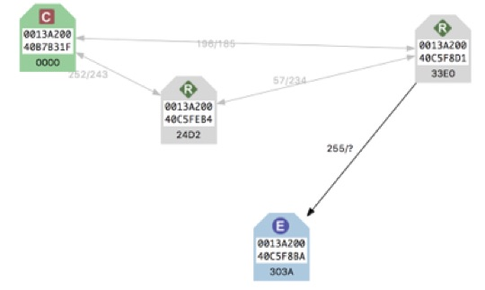

**XBee coverage tests.**  Once a simple network was assembled to send empty packets to the coordinator in close proximity, the range and coverage of the XBee modules were explored.  The XBee range capability experiments were performed in three main steps: range, coverage, and network tests.  The range tests aimed to find the maximum range of the XBee modules in a clear line-of-sight (LOS) path.  The coverage tests were performed to find the quality of the signal in all directions including non-line-of-sight (NLOS) environments.  Finally, the network tests were performed to simulate the proposed bikeshare where nodes would be placed accordingly in order to maximize reliable communications with a defined set of bicycle racks on campus.

**_Range tests._**  The range tests were conducted using the XCTU’s built-in range testing software, depicted in Figure 36.  Within the program, two XBee modules can be selected to monitor their received signal strength indicator (RSSI) and the packet success rate over time.

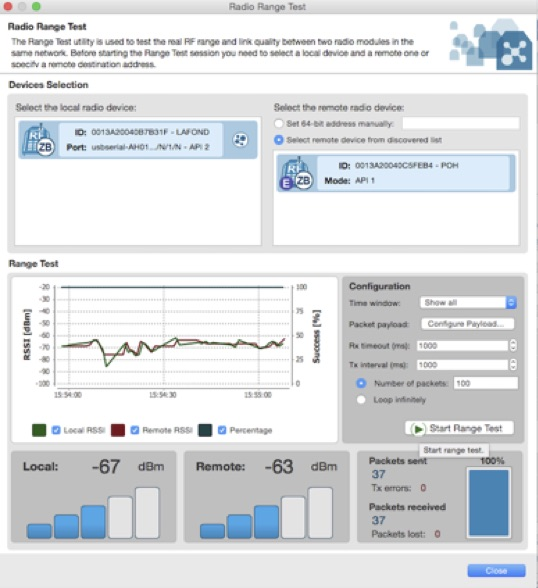

The range test was first conducted at McKeldin Mall where a maximum LOS distance of approximately 1,100 ft was measured via Google Maps, depicted in Figure 37.  The range test was conducted by leaving the coordinator node stationary in front of McKeldin Library while having the end device node move farther away from crosswalk to crosswalk.  The range test was conducted at each intersection of the crosswalk.  At the initial crosswalk, the signal strength was recorded at an average value of -50 dB, and as the end device moved away the signal strength expectedly decreased.  The documentation for the XBee modules used in the experiment claim to have an acceptable RSSI range of -40 dB down to -102 dB.  By incrementing across McKeldin Mall, the modules proved to maintain a strong RSSI reading throughout the entire test.  Upon reaching the end of the Mall, at approximately 1,100 ft, the modules were still maintaining an average RSSI of approximately -70 dB, well within the documented acceptable region.

Since the initial range test occurred without achieving the goal of finding the maximum distance of connectivity, a new site was selected for an additional range test.  The next site was selected since it has the longest LOS path on campus.  This makes it the optimal test for the system since the final system will not need to reach LOS distances that cannot be reached on campus.  The test was conducted across the Chapel and Fraternity Fields, depicted in Figure 38.

The new test site was able to leverage the elevation difference between the entrance to Memorial Chapel and the far east edge of the Fraternity Fields to obtain a measured distance of approximately 1,650 ft.  The test was conducted in a similar fashion to the initial test with the end device moving in increments away from the coordinator.  The maximum distance of 1,650 ft returned a packet success rate of 100% while maintaining an average RSSI value of -75 dB.

The differences in distance and RSSI between the first two tests came out to 540 ft and -5 dB, respectively.Noting the XBee documentation claims of receiver sensitivity down to -102 dB, the XBee units should hold for all possible LOS communications links achievable on campus for the sake of the project.  Should the units be located at higher elevations, such as rooftops, it would be possible to extend a clear LOS connection that may fall outside of the tested range.

**_Coverage tests._**  The coverage tests were performed in two ways.  Initially, the same XCTU range test program was used where a stationary coordinator would run tests against a moving end device.  The largest difference between the range and coverage tests had to do with the NLOS conditions.  In the coverage tests, a person carrying the mobile node would walk in all directions until the signal was lost, instead of only walking in one direction maintaining LOS, and then the person documented the location of the lost signal on a printed out map.  The test was conducted at McKeldin Mall with the coordinator located at the same location as in the initial range test.  During the test, the XBee modules appeared to drop the signal at approximately -90 dB, slightly less than the expected -102 dB claimed in the documentation.  Once the test was completed, the boundary points were entered into Google Earth to plot a rough sketch of the coverage region of a single node, depicted in Figure 39.  Note that the red dot is the location of the stationary node, and the blue region is the coverage area.  It was later discovered that the test experienced issues during the data collection in the most northeast location of McKeldin Mall.  The actual coverage information within that region extends slightly farther north and east.

A flaw with the approach for the coverage test was that the data displayed in Figure 39 above depicts a binary representation of the coverage region, meaning either the location has connectivity to the coordinator or it does not.Given the great deal of fluctuation in RF systems, any number of conditions such as: population, weather, or device orientation, could affect the exact coverage region.  To provide more meaningful data, the signal strength should be measured at each point to provide insight into which regions are more susceptible to potential losses in the connection.  In order to more accurately display the coverage region, a heat map approach was proposed.  The heat map test would include a device that could log the GPS location and RSSI while the user carries the device around.  The device could then save the information and pass it on to a mapping library such as Leaflet or Google Maps.

Building the system necessary for the heat map test presented new problems with logging the RSSI value.Within the ZigBee protocol for the XBee Series 2 modules used, the RSSI is not sent with each packet.  Instead, the receiving module measures the RSSI of the last received packet and stores it locally.  The value can then be requested locally using the ATDB command.  To implement a device that can update the RSSI values at each point, a new packet from the coordinator had to be sent repeatedly at a desired interval.  Without the coordinator constantly sending packets, the RSSI value stored on the local XBee module would remain unchanged throughout the polling period.  After learning how the RSSI value can be recovered, a device was built using a Raspberry Pi, an Adafruit Ultimate GPS Breakout Board, an Arduino Uno, an XBee end device, and a portable battery as seen in Figure 40.

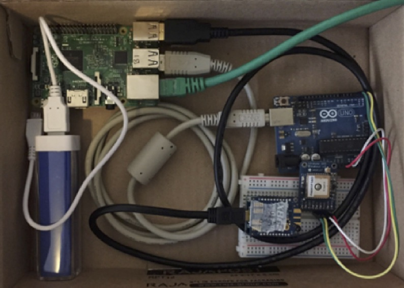

The heat map data collector device used the portable battery to power the Raspberry Pi, which in turn powered the Arduino and the XBee through USB connections.  The GPS board was connected to the Arduino where the TinyGPS+ library was used to parse out latitude, longitude, altitude, and time every second from the NMEA data output.  The Arduino then printed out the information in CSV format to the serial port.  On the Raspberry Pi, a python script read in the serial data from the Arduino to read back the GPS data at any given time.  The python script also utilized the XBee-Python library to interact with the XBee in order to assemble the AT command to request the RSSI.  With the walking pace set by the user holding the heat map data collector, it was found that polling the RSSI every five seconds sufficiently collected data for use in the generation of the heat map.  An important note to make is that in order to sync the RSSI data polled every five seconds and the GPS data received every second, the serial port connection with the Arduino had to be flushed to receive the latest GPS coordinates immediately following an RSSI request.

After developing the heat map data collector described above, the team found that the Raspberry Pi did not provide enough feedback while the test was being conducted.The system was then simplified to include solely the Arduino, the GPS, and the XBee, where the Arduino and XBee module were connected to a laptop, rather than the Raspberry Pi, as depicted in Figure 41.

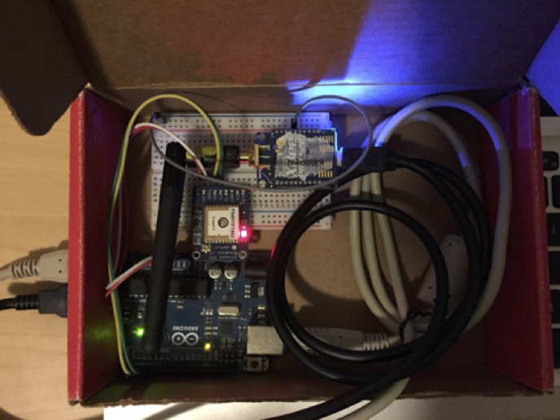

With the new system assembled and ready to be used, the first heat map test was conducted at McKeldin Mall, with the coordinator located at the same position as in previous tests.The heat map data collector with the accompanying laptop was then carried around the mall in a vertical zigzag pattern.  While walking, the device collected the data needed to generate a heat map and wrote it to a file in the CSV format seen in Figure 42.

At the conclusion of the test, the data was then read into a Leaflet mapping program to turn the GPS coordinates into scaled intensity values based on the RSSI.Since the RSSI is recorded as negative values ranging from approximately -30 dB (strong) to -90 dB (weak), the RSSI was mapped to the intensity factor inversely.  The result of the Leaflet map can be seen below in Figure 43.  Note that the XBee icon represents the location of the coordinator for the test.

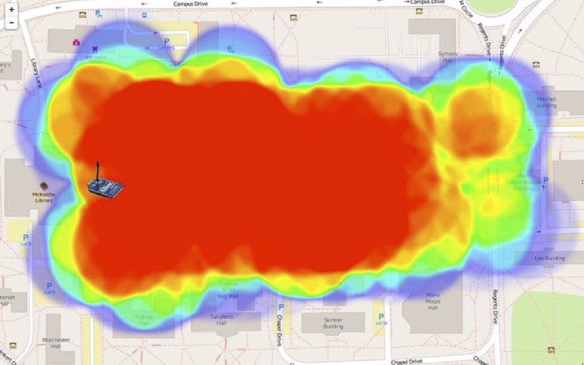

The same heat map with the walking path superimposed can be seen below in Figure 44.  With the walking path inserted, it can be seen that the data in the center of the triangle formed at the far right of the heat map alters from reality.  Leaflet generated the heat map by taking each individual point and applying a circle with the intensity value determined from the RSSI and then slowly reducing the intensity as the distance from the center increased.  Because of this technique, the center of the right triangle appeared to be weaker than the north east point of the triangle even though the center was closer to the coordinator.  In reality, the center of the triangle had a higher RSSI value than the north east point.

Other pitfalls with the Leaflet heat map generator involved the same fading circle technique.  With the fading circle, weaker points in close proximity to stronger points were masked by the stronger point’s computer-generated coverage region.  In addition, the boundaries of the coverage area seeped into the adjacent buildings despite the reality being that there was no signal inside the buildings.  Viewers of the heat map may also find it difficult to determine where the heat map test took place due to the opacity constraints blocking out the location behind the coverage region.  One final issue with the map was that it also failed to distinguish a difference between the strongest signal near the coordinator at approximately -35 dB from the decent signal located throughout much of the Mall at about -70 dB.

In an attempt to improve the heat map’s display, Google Maps’ heat mapping tool was explored.Taking the same data but applying a slightly different scaling factor resulted in a much more visually appealing heat map, depicted in Figure 45.

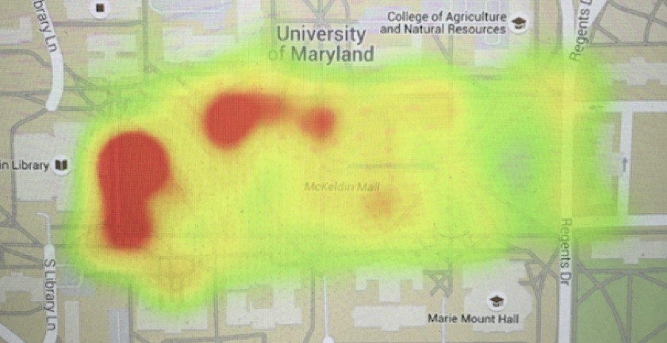

The Google Maps heat mapping tool succeeded in distinguishing the difference between signal strength of a decent and a strong signal, and it also succeeded in allowing the viewer to see more of the map detail behind the heat map.Aside from those two improvements, Google Maps still failed to provide the desired heat map image of preserving the reality of the data.

The desired heat mapping tool would allow the user to select a source point where all generated points would tend to decrease from.It would preserve the reality of each data point and fill in the gaps between the real data points with mesh data to transition from real data point to real data point while tending to decrease away from the source.  The heat mapping tool would also need to have an option to insert harsh boundaries where the edges of the buildings could be entered to show that in reality there is no signal inside the classroom buildings.

**_Network test._**  The final stage of testing for the XBee units came in the form of network connectivity tests.  The goal of the network tests was to take the information learned from the previous range and coverage tests and apply it to a selected area of campus.  This would allow the team to intelligently place the stationary nodes of the ZigBee network in order to provide coverage to all of the bicycle racks in the selected region.  To obtain the bicycle rack location information, the “UMD Campus Web Map” was used with the bicycle rack location layer turned on.  With the bicycle rack location layer on, all of the bike racks on campus appear on a map as red marks as seen in Figure 46.

To decide how to run the network tests, the team targeted two specific student types: freshmen and sophomores living in the Ellicott Community studying a humanities field and freshmen and sophomores living in the Cambridge Community studying a science field.  With these two subsets of students, the team could target specific areas on campus to implement a scaled down network with the limited hardware available.

The first test conducted was on the first student subset: freshmen and sophomores in the Ellicott Community studying a humanities field.  To accommodate this subset of students, all of the bicycle racks in the Ellicott Community will need to be covered by a ZigBee network, as well as all of the bicycle racks near the buildings around McKeldin Mall.  Creating a connected network between the two areas posed a problem due to the distance between the two as well as the lack of any LOS path from one to the other as depicted in Figure 47.  The team considered leveraging the altitude of the high-risers in the Ellicott Community, but the inaccessibility of the rooftop of the high-risers prevented a clear test from being conducted.  Even if the module could be placed on the roof of Ellicott Hall, it remained doubtful that an elevated module on McKeldin Mall could create a clear LOS path to the Ellicott community to close the link.

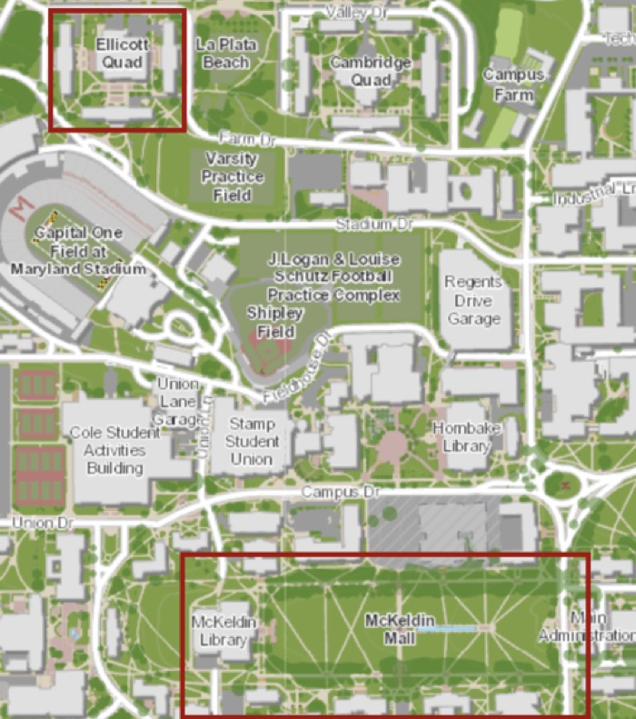

Since the use of a single, connected network between the two areas seemed unlikely without a long stream of routers acting as a backbone, the idea of interoperable, yet separate networks was explored.  The proposed idea was that a single coordinator could be set up in the Ellicott Community while an additional single coordinator, operating on the same personal area network identifier (PAN ID), could be set up at McKeldin Mall.  Then, in theory, the end device units located on the bicycles could connect to both of the coordinators since they have the same PAN ID.  Unfortunately, the multi-coordinator test failed on the initial attempt due to an additional read-only XBee parameter called the 16-bit operating PAN ID.  The parameter was specific to each XBee coordinator module such that all of the nodes in the network would be specific to solely that coordinator after the network was established.  The routers and end devices on power-up first search for a coordinator on their writable PAN ID.  Should the units find a coordinator, they then set their 16-bit operating PAN ID to match that of the coordinator and remember that number so on the next power-up, they can simply attach back to the network without scanning.  Since the 16-bit operating PAN ID of both coordinators was different, the end devices that would be located on the bicycles would not be able to establish a connection with the second coordinator.

Fortunately, there exist XBee parameters to fix issues with establishing connections to a coordinator using a separate 16-bit operating PAN ID.  In the XBee community, people have had issues after a firmware update where the coordinator obtains a new 16-bit operating PAN ID.  Once the parameter is changed because of the firmware update, all of the previously connected routers and end devices would no longer be able to join unless they too receive a firmware update.  Within the XBee module’s parameter list, there are three options to go about resolving this issue: forced dissociation, channel verification, and network watchdog timer.  Through forced disassociation, the routers or end devices could be sent the AT command, ATDA, to force the module to remove itself from the previously established network and rescan for a new one.  Using channel verification, the AT command, ATJV=1, could be sent to the routers or end devices to instruct the modules to verify that there is a coordinator on their operating channel when the device is restarted.  If the module finds that there is no existing coordinator on its 16-bit operating PAN ID, it then rescans to attempt to find a new one.  The final solution that could be implemented is through use of the network watchdog timer.  The AT command, ATNW, instructs the device to wait a set amount of time in integer multiples of three minutes, and if no coordinator was found on its existing 16-bit operating PAN ID, the module then rescans to find a new one.

Since the probability of a bicycle user leaving one community and biking to a distant area exceeds the probability of a short bicycle ride, the minimum time allotment of three minutes for the watchdog timer exceeds the desired delay in the system.  The forced dissociation solution provides a faster solution.  However, it would require more logic on the smartlock end of the system due to the additional packet type needed, especially considering the fact that the end device on the smartlock is currently configured to operate in AT mode.  The channel verification option then proved to be the best solution for the multi-coordinator problem.  With channel verification enabled, the smartlock could reset the XBee end device upon stopping, in turn causing the module to disassociate itself with the previous network and immediately begin scanning for the new coordinator on the same PAN ID.  Though these parameters seem to be only used to solve unwanted problems in the community, they can be leveraged to make the network on campus smarter and cheaper.  The theory was first tested out by powering on a coordinator and end device pair and sending packets between the two to prove connectivity.  The coordinator was then powered off to simulate the end device leaving its coverage area.  A new coordinator was then powered on with the same PAN ID but a different 16-bit operating PAN ID to see if the end device would establish a connection.  The end device, with channel verification enabled, was then reset to simulate the logic on the smartlock to reset the module upon arriving at its destination.  Within seconds, the end device successfully rescanned and established a connection with the new coordinator, proving that the multi-coordinator network on campus was feasible.

Since the Ellicott Community and McKeldin Mall could be connected through separate networks connected through the website rather than a continuous, single mesh network, it was hypothesized that all of the bicycle racks in the two areas could be covered by simply two, intelligently-placed coordinator nodes.  To test the hypothesis, an additional heat map test was performed in the Ellicott Community.  With the coordinator placed at ground level by the north east corner of Ellicott Hall, the following heat map was created using Leaflet, depicted in Figure 48.

Taking note to visit all of the bicycle racks in the community during the test, the single node was proven to have reliable communication to all of the bicycle racks.  Again using the UMD Campus Web Map’s bicycle rack location layer, the network routing map was drawn, Figure 49.

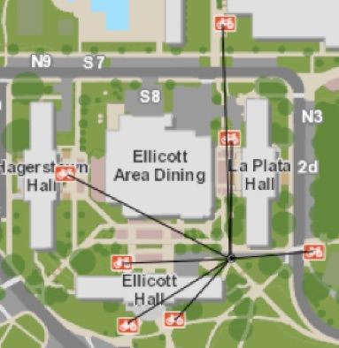

The same network routing map was then applied to the single node covering McKeldin Mall during the earlier heat map tests to provide the following mapping, Figure 50.

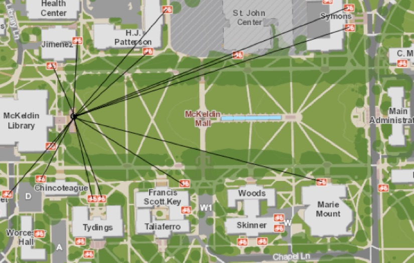

With the subset of freshmen and sophomores living in the Ellicott Community studying a humanities field, it was proven that with two separate, but connected networks, 21 bicycle racks could be covered with only two XBee modules configured to act as coordinators operating on the same PAN ID.

The next test involved the subset of students who were living in the Cambridge Community studying a science field.  The desired region of coverage included the Cambridge Community as well as the buildings along Regents drive.  With the close proximity of these two, it is hypothesized that the targeted coverage region can be covered through the use of a single, multi-node network as depicted in Figure 51.

Without being able to leverage the advantages that elevation would provide with LOS, the network was set up with the coordinator just west of the southern tip of Centerville Hall, a router slightly north east of the southern tip of Cumberland Hall (maintaining LOS with the coordinator), and a second router positioned at the intersection of Farm drive and Regents drive.  With the nodes positioned as stated, the two routers were powered via laptop USB, and the coordinator was powered by and interfacing with an additional laptop running the XCTU software.  A fourth node was set up as the mobile end device, connected to another laptop running XCTU.  The experiment was to walk the end device around to each bicycle rack in the two regions in an attempt to prove connectivity.  At each bicycle rack, the end device module was reset, to simulate the actual use in the smartlock design due to the multi-coordinator network requirements.  Then a transmission request was sent to the coordinator, to simulate the CSV formatted information to be sent from the bicycle to the website.  Upon receiving the packet, the coordinator would then send an acknowledgement packet down to the specific XBee module to simulate the response from the website to the smartlock.  Once the transmission was seen to be reliable for both directions, the coordinator would run the routing test to discover the path that it was taking to reach the end device.  At each bicycle rack, the path was documented and then the end device would move on to the next bicycle rack.

After conducting the test at the Cambridge Community with the goal of reaching the buildings along Regents Dr., as well, the following network routing maps were drawn to show the connectivity between devices depicted in Figure 52 and Figure 53.

Within the figures, all of the lines represent a stable communications link between the two nodes, whether it be bicycle rack to router, bicycle rack to coordinator, or router to coordinator.  Through analyzing these figures, several key aspects of the XBee modules can be observed.  First, observing the Cumberland Hall bicycle racks shows the XBee’s inability to propagate through the dormitory to reach the bicycle rack on the west side.  However, viewing the bicycle rack on the east side of Centerville Hall shows that the coordinator was successful in propagating through the dormitory.  The difference observed may be due to the amount of structure that the RF waves had to pass through due to the difference in angles between the stationary node and the bicycle rack.  Additionally, the distance from the building to the bicycle rack was further in the Cumberland case, meaning that once through the building the waves still had to propagate further to reach the bicycle racks.  The distance to wrap around the southern side of the building was also shorter in the Centerville case, which lead to the possibility of the wave reaching the destination in another fashion through leveraging multipath, or the RF signal’s ability to bounce off of objects.  Regardless, it is recommended that further network tests be completed to ensure that the link is reliable in all situations.

An interesting result of the experiment was that bicycle racks that were completely obstructed by buildings, such as the ones located in front of the School of Public Health, consistently had no communications link with the network.  Additionally, the bicycle racks that almost had LOS but were far away from the stationary node also failed to have a stable communications link, such as the bicycle racks that were slight back from Regents Dr.  These observations are critical to note when optimizing node locations to maximize coverage.

**Proposed network system.**  Taking into consideration all of the information from the tests conducted, the next step was to provide a strategy for developing a campus-wide network.  To make the problem simpler, the objective is not actually to cover the entire campus, but rather to cover every bicycle rack on campus.  Then taking into account the fact that there exist bicycle racks that are not used by the target student population and that the initial system may not need to cover the entire campus, a target of 90% of all bicycle racks on campus is selected.  The goal of the proposed system is then decided to maximize coverage of bicycle racks with a minimum of 90% of all bicycle racks covered, minimize number of stationary nodes (routers and coordinators), and minimize cost.  It is important to note that the requirement to minimize nodes and cost are different due to the coordinator cost exceeding that of the routers because of the Internet capability requirement.  In other words, it is preferred that the network be expanded through the use of an additional router, rather than implementing a new network through a new coordinator should the router still provide a sufficient amount of additional coverage to the network.

Before the proposed system problem is tackled, a quick analysis of the system set up through the tests is completed to aid in the process.  The coverage and network tests were completed in three different locations: McKeldin Mall, the Ellicott Community, and the Cambridge Community to Regents Dr.  At McKeldin, one node configured as a coordinator ran a single network that had connectivity to 14 bicycle racks.  At Ellicott, one node configured as a coordinator ran a single network that had connectivity to 7 bicycle racks.  And at Cambridge, three nodes in a single network has connectivity to 21 bicycle racks.  Leveraging the interoperability of the multiple networks, all three can be combined to consist of five stationary nodes reaching 42 bicycle racks.  Given the cost of each node is about $40 with an additional cost per coordinator of $40, a quick cost analysis shows that the three networks combined would have an installation cost of approximately $320.  The total cost per bicycle rack then comes out to be around $7.62.  Granted, the tests were conducted on some of the more dense areas on campus in regards to bicycles racks.

After running the small scale math on the collected data above, the proposed system was then drawn out.  Using the data collected from the coverage and range tests, the XBee modules’ ability to maintain connectivity with distant points was characterized.  In the proposed system, the model assumes that the installer has access to higher elevation areas such as rooftops or edges of buildings to enhance the LOS capabilities of the devices.  The UMD Campus Web Map was again used as a reference for the bicycle rack locations, and another note to make is that the bicycle racks located at Fraternity Row and off campus housing complexes were not considered.  The campus was then broken into subsections based on how dense the bicycle racks were.  Within each section, proposed node locations were listed as GPS coordinates that typically would be elevated to maximize coverage.  The result of the analysis is shown in the table below in Figure 54.

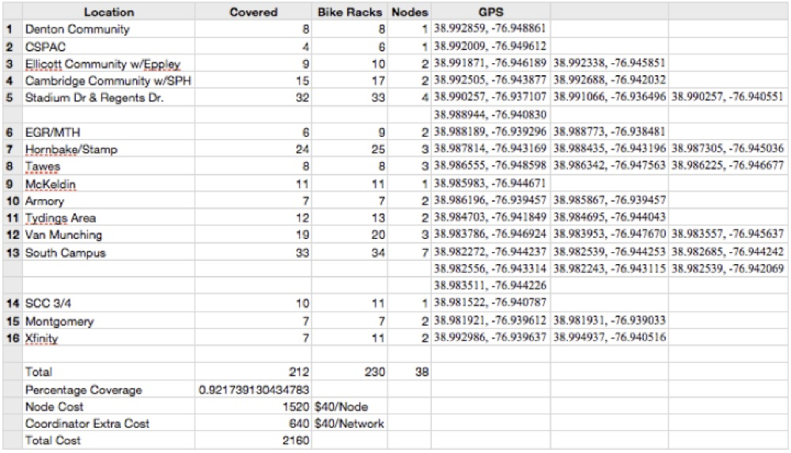

The table shows the subsections of campus, the locations of each network, the number of bicycle racks covered by the network, the total number of bicycle racks within the subsection of campus, the number of nodes in the network, and the GPS locations of each of the nodes in the network.  As seen from the table, the proposed system would include 16 interoperable networks with node amounts ranging from a single coordinator up to seven stationary nodes.  The system would cover 212 out of the 230 bicycle racks in the defined regions on campus, resulting in 92.2% coverage, exceeding the 90% requirement.  At the same estimated costs per node and extra costs per coordinator, the system came out to be approximately $2,160.  The cost per bicycle rack then was calculated to be $10.19.  The value was slightly higher than the real data test, but since the data was collected at more densely populated bicycle rack areas on campus, this result was expected.

In order for the network to cover all of the bike racks on campus, the bike racks missed in the calculations above would require their own independent networks. This would result in 56 total nodes at a cost of $3600.
