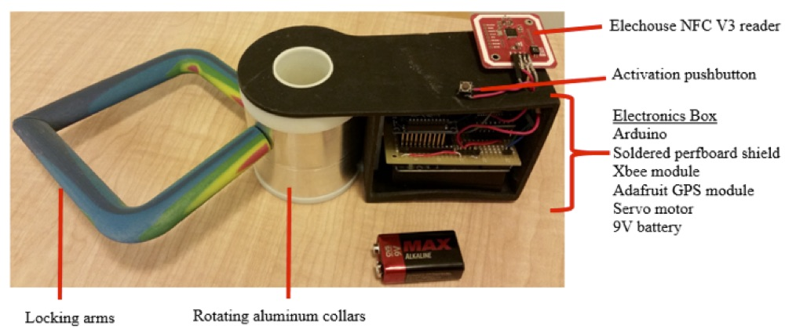
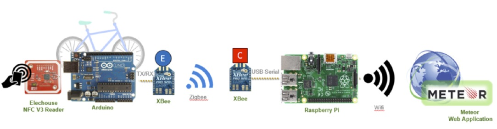
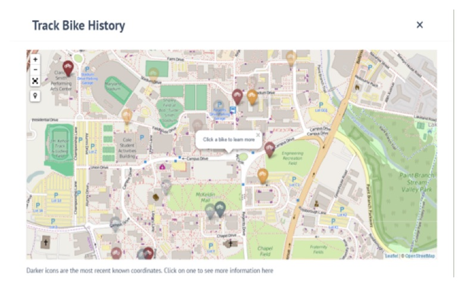
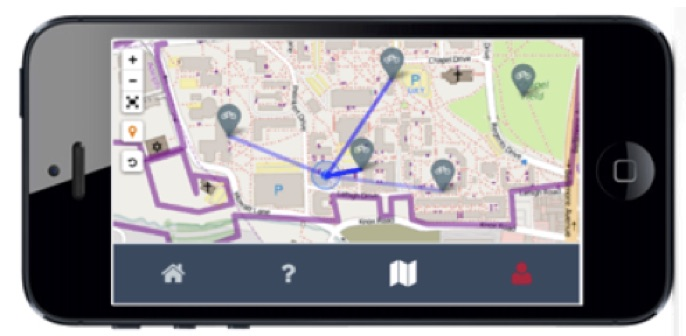

# Executive Summary

The concept of a bikeshare is an intuitive one: give individuals the opportunity to borrow a bicycle, ride it to another destination, and leave it behind once locked.  The complexities arise when contriving a means of securing, locating, and accessing the bicycles in a secure and user friendly fashion.  Large, metropolitan bikeshares currently answer these questions by using bicycle docking stations from which riders rent and return bicycles.  Each station is equipped with a kiosk connected to a remote server that verifies user access privileges and a number of locking bays for bicycles.  Stations are located around the city, and users may rent and return bicycles to and from any station.  These distributed stations provide a high degree of mobility for visitors and daily commuters alike, and one could postulate that any area with a dense population that moves about, like a college campus, could benefit from such a system.

The flaw in concluding that a conventional, stationed bikeshare model will meet the needs of students on a college campus is the assumption that the movements of individuals on a college campus mirrors the movement of individuals around a city.  Around a college campus, individuals are more likely to make short, erratic, high frequency trips between classes, meetings, and social events.  These erratic trips contrast against the more regular and predictable routes of city users and riders who use the bikeshare to commute.  For the commuters, it is very likely that a station will be located closer to their final destination than their starting location.  On a college campus, however, it is quite possible for the sum of the distances from a student’s starting point to the first station and from the second station to the student’s final destination to exceed the distance between the start and end points in the first place.  For this reason, a bikeshare that is stationless, one that allows users to securely park bicycles to existing bike racks rather than a small set of custom docking stations, would be better suited to a college campus.

The objective of this thesis is to provide a proof of concept of a stationless bikeshare which relies on a smartlock permanently attached to the bicycle that overcomes the technical challenges associated with creating a bikeshare system tailored to the needs of a college campus.  This was accomplished by dividing the task among four subteams of students each with a different focus so that development of the smartlock system’s components could be carried out in parallel. The Locking subteam was responsible for the mechanical design of the lock. The Geolocation subteam devised a wireless network to locate the bicycles in the system in addition to a web server to process the bicycle locations and provide this data to bikeshare users. The Access Control subteam configured the electronic interface between the network communications, the user identification system, and the mechanical locking mechanism. Finally, the Business subteam generated recommendations for the operation of the stationless bikeshare.

Before beginning to design the system, the team carried out a thorough review of existing bikeshares, commercially available locks, wireless communication protocols, and web server frameworks.  The literature review generated several hypotheses that were tested by each of the subteams.  To determine the failure characteristics of commercial locks and influence the physical design of the smartlock, the Locking subteam conducted several stress-strain analyses of existing locks. The Geolocation and Access Control teams developed code for the electronic components and web framework selected in the literature review.  The Geolocation team also tested the signal strength of the modules used to form the wireless mesh network to determine their limitations and ensure that technology identified during the literature review worked as expected.  Finally, the Business subteam spearheaded a focus group discussion to gauge the reaction of potential users to the physical design of the smartlock, the web application, and the business plan initially generated by the team. During the focus group discussion, participants had the opportunity to interact with 3D printed models of several different smartlock designs and the mobile web application.  This resulted in valuable feedback that the team used in addition to knowledge gained through rapid prototyping to create a final design for a functional smartlock and the outline of a business strategy to market the system.

The final smartlock design, shown in Figure I, includes a mechanical lock comprised of locking arms that open and close as two aluminum collars rotate.  The motion of these collars is restricted by a pin, not visible in Figure I, which prevents rotation unless the pin is retracted into the adjacent electronics box.  The hardware, protected inside the electronics box, is controlled by an Arduino Uno microcontroller that sends and receives signals from a number of different electronic modules used to provide location data, user identification, wireless network connectivity, physical stimuli, and power to the system. For user identification, an Elechouse NFC V3 module reads a user’s ID off of a MIFARE smartcard, analogous to a metro SmarTrip card, using near field communication (NFC).  In this case, NFC relies on an active reader circuit, the Elechouse module, to procure the tag ID stored inside of the passive circuitry in a MIFARE smart card. An XBee module that operates using the Zigbee wireless protocol was selected for providing wireless communication and relaying data from the bicycles to the web application. The module can be operated as part of a mesh network so messages from the bike, an end device, can be carried through a system of routers to a coordinator.  The coordinator sends the message to the server and upon a response can redistribute the message through the router system. The entire flow of information from tag to server is illustrated in Figure II.

To demonstrate the value of the Zigbee communication protocol to our system, the Xbee module range was tested in several different locations around the University of Maryland’s campus.  This testing allowed the team to accurately assess the effect of buildings and other obstructions on the signal strength.  From the results, the team extrapolated a proposed 56 Xbee node system that could cover every bike rack on the University of Maryland campus.   Furthermore, once data is transferred from the smartlock to the web server, the web application can respond in real time to verify a user’s ID or to update the location of a bicycle in the online database.  The website can then utilize this database to provide real time bicycle locations, administrator dashboards, or other web tools to confer relevant information to users and system administrators, as seen in Figures III and IV.

Beyond the engineering required to implement a stationless bikeshare, this thesis also provides a discussion of the business decisions that must be made in order to realize the system. The suggested business plan provides an overview of the responsibilities that the system operators will have to take on, ranging from typical bikeshare operational activities such as maintaining the fleet size and managing users, to challenges unique to a stationless system such as expanding the wireless network coverage. The plan goes on to propose a pricing system that allows for flexible enrollment periods and imposes a fee for users who exceed the maximum rental time allotted. Finally, the plan addresses the information that the operators must provide to users in order to promote the safety and security of the riders and the bikeshare system as a whole. This includes clear bicycle safety training and a detailed description of how to operate the bikeshare.

The completed smartlock prototype and proposed implementation model demonstrate a new paradigm for stationless bikeshares utilizing a novel mesh network, a real time web application, and an innovative bike lock design. The conclusion that we drew from the process of engineering the smartlock is that the technological challenges presented by a stationless bikeshare can be overcome in order to deliver the flexibility demanded by individuals moving about on a college campus.  Removing the stations from the system greatly reduces the initial capital required for a bikeshare system and exponentially increases the user's’ freedom.

https://www.youtube.com/watch?v=tg4aXH1SqxQ

