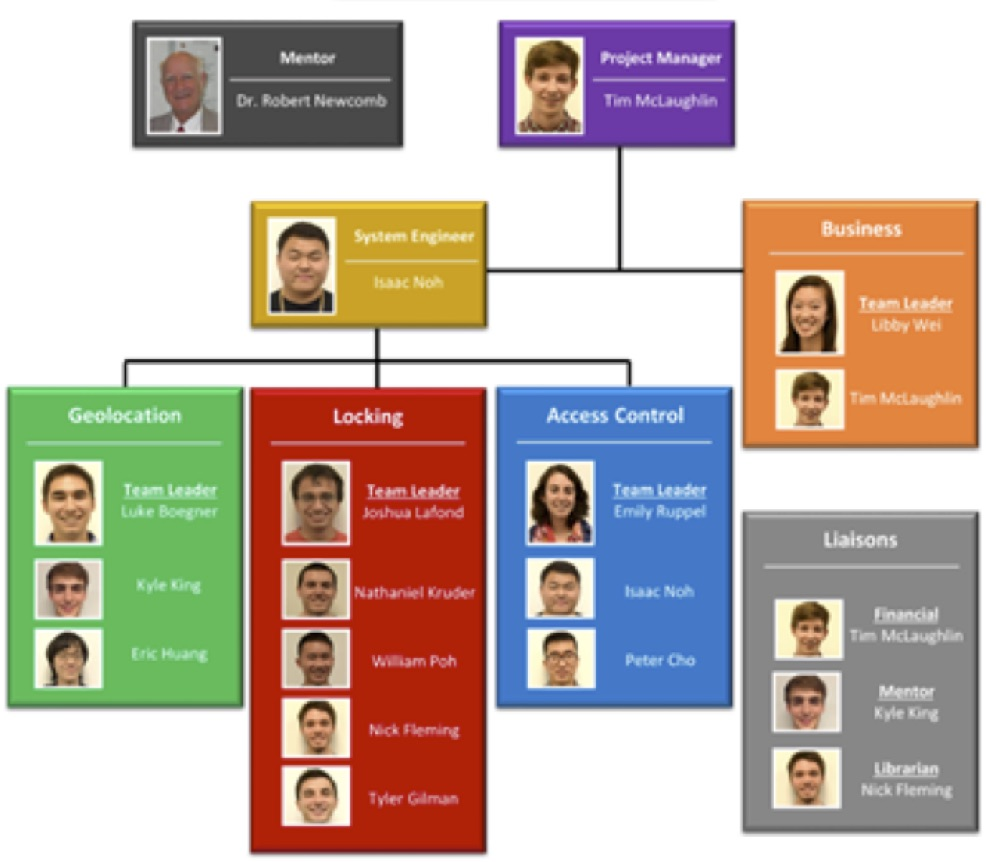

## Team Organization

In order to delegate tasks and accomplish the goal of proving the feasibility of a stationless bikeshare, the team decided that it was best to break the team off into four subteams, each with particular focus on a different part of the bikeshare design.  The subteams include: Business, Locking, Access Control, and Geolocation.  The Business subteam took on the responsibility of organizing the focus group discussion and the details related to the operation and design of the business side of the bikeshare.  The remaining three subteams fell under the category of technological development.  The Locking subteam’s responsibilities were testing lock fixtures and developing a smartlock.  The Access Control subteam’s responsibilities were developing a means of unlocking the lock using RFID technologies.  The Geolocation subteam was tasked with developing a way of tracking bikes, storing this information, and creating a front-end website for users and administrators.  With the nature of the project, each subteam needed to communicate with other subteams to address problems and make sure that there was consistency, especially when it came to software compatibility and lock measurements.

In addition to the three liaisons per the Gemstone Department’s guidelines, the team created the roles of project manager, to oversee the entire project and lead meetings, and system engineer, to oversee the technology subteams.  The team’s organizational tree can be found in Figure 2.

