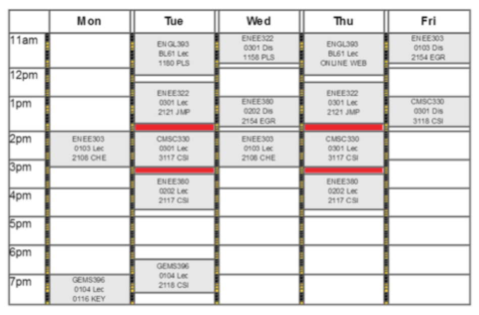

# Team B.I.K.E.S. (REDBAR BIKES)

<!--TODO: Upload video of demonstration-->
<!--TODO: Upload thesis, somewhere?-->
<!--TODO: Link Previous Versions in Releases Page-->
<!--TODO: Add better guides to Arduino and Raspberry Pi Guides-->
<!--TODO: Share RFID's code in Arduino Folder?-->

<!--

<h6 align="center"><i>figure</i></h6>
###### &nbsp;
-->

<!--
Video problems:
(Use Youtube thumbnail - Replace with thumbnail with overlaid play button)

-->

> A bikeshare for college students by college students [redbarbikes.com](https://redbarbikes.com)

# About

As a 13-person team in the Gemstone Program at the University of Maryland, College Park, we prototyped a smartlock to be used for a stationless bikeshare. We think that bikeshares are exciting systems that promote biking as a sustainable, convenient, and healthy alternative and we hope to see them on college campuses across the nation. This technology is one such concept that might help make stationless bikeshares more secure and cost-effective for college campuses.

In typical Gemstone fashion, our name is an acronym for: Bikeshare-Intended Keyless Encrypted Smartlocks

We hope you find this repository helpful and feel free to [open an issue](https://github.com/KyleKing/TeamBIKES/issues) to reach out to me (@kyleking) and/or the rest of the team.

<!---->

  

<h6 align="center"><i>RedBar Bikes Commercial (Click to Watch on Youtube)</i></h6>

<!--###### &nbsp;-->

# The Technology

Our system is based on a custom smartlock that sits below the bike seat and securely attaches to the frame. In the final implementation it would allow for the seat to be adjustable, but would use a mechanical catch to prevent the seat post from being completely removed. Additionally, the wheels would be secured using locking skewers, which freed us to develop an extremely convenient lock that only needed to directly secure the frame. The design rotates out to be locked to a bike rack and rotates back in for riding. Behind the lock ring there is an electronic control system based on an Arduino Uno.

  

<!---->

<h6 align="center"><i>The custom smartlock with integrated electronics</i></h6>

###### &nbsp;

  

<!---->

<h6 align="center"><i>Demonstration of smartlock use</i></h6>

###### &nbsp;

  

<!---->

<h6 align="center"><i>CAD Animation of Locking Mechanism</i></h6>

###### &nbsp;

Each lock is equipped with an RFID reader that approves user access using our wireless mesh network and web application. The wireless mesh network is built using XBee modules. The modules serve either as an end device on each bike, a router to send the signal over a greater distance, or attached to a Raspberry Pi as a coordinator to relay the information to the web application. This system allows for a great level of flexibility and rapid two-way communication.

  

<!---->

<h6 align="center"><i>Single Unit Diagram</i></h6>

###### &nbsp;

  

<!---->

<h6 align="center"><i>Network Diagram</i></h6>

###### &nbsp;

###### Authentication Protocol (Steps In Order)

| Device | Operation |
| ----- |:-------:|
| RFID - Elechouse NFC | Collects user RFID Tag |
| Arduino and XBee End Device | Sends RFID tag, location, and lock state information to nearest router |
| XBee router(s) | Passes the received information on to the coordinator |
| Coordinator | Receives and parses the incoming message, then calls a remote Meteor method |
| Web application | Confirms RFID authenticity, adds necessary information to the database, and returns a JSON object of results |
| Coordinator | Runs callback function on Meteor method completion. Sends a return command to the specific end device based on the received results |
| Arduino and XBee End Device | Receives message and makes appropriate action (keep the lock closed or unlock) and sends a "message received" response to the coordinator |

###### &nbsp;

  

<h6 align="center"><i>Authentication Demonstration (1/8 speed)</i></h6>

###### &nbsp;

The web application can utilize the information received from the mesh network and display available bike locations, track user rides, and conduct administrative tasks. To explore the features and code that makes this possible [see the website guide below](#how-to-use-this-repository). To test the features of the website, please visit [redbarbikes.com](https://redbarbikes.com).

Once on the site, you test different user roles by signing in as an administrator or student with the light blue buttons on the login page. Try out exploring the [administrator dashboard](https://redbarbikes.com/Dashboard) by searching each table column, then click on any row to open up an additional slide in panel. On the [map page](https://redbarbikes.com/Map), try reserving a bike by clicking any of the grey icons.

  

<!---->

<h6 align="center"><i>Web Application shown in an iPhone 5</i></h6>

###### &nbsp;

For additional information on our smartlock and system, please see our complete thesis on the literature review, methodology, and design that went into developing the smartlock. [Will be available online soon]

# Business Concepts

Our lock was built to push the boundaries of the technology for stationless bikeshares. We wanted to explore the potential of the "new kid on the block" framework, Meteor; push the boundaries of XBee modules as a campus-wide mesh network; and design a user experience around a convenient and secure smartlock. While the foundation for a bikeshare, this lock would make the most sense to stationless bikeshare operators seeking to improve user value, while reducing system costs.

However, if we were to build this bike lock into a bikeshare, we conducted preliminary research into initial installation costs and branding. Our brand was specific to the Maryland campus that we started on. We were inspired by the "redbars" that would appear in between classes as a warning that a student would have difficulty in arriving on time. This would often appear when a class was on North Campus, but the student's next class was on South Campus and there would only be a ten minute gap to traverse the campus. Our bikeshare was meant to solve transportation issues exactly like this.

  

<!---->

<h6 align="center"><i>UMD Student Schedule</i></h6>

# How to Use This Repository

Download one of the version of the repository from the releases page (TODO: link). To get the most up to date version, press the `Download Zip` button above.

Once downloaded and unzipped, enter the directory (i.e. `cd ~/Downloads/TeamBikes`).

To learn about each subfolder, visit the specific README. For example, to learn more about the Meteor Web Application, go to [`/Meteor Web Application/README.md`](https://github.com/KyleKing/TeamBIKES/blob/master/Meteor%20Web%20Application/README.md).

| Folder | Contents |
| ----- |:-------:|
| [`/Meteor Web Application/`](https://github.com/KyleKing/TeamBIKES/blob/master/Meteor%20Web%20Application) | The source code for the deployed web application available at [redbarbikes.com](https://redbarbikes.com) |
| [`/Coordinator_Raspberry Pi/`](https://github.com/KyleKing/TeamBIKES/tree/master/Coordinator_Raspberry%20Pi) | The Node.js application that runs on the coordinator device for remote communication to the Meteor web application |
| [`/End Device_Arduino/`](https://github.com/KyleKing/TeamBIKES/tree/master/End%20Device_Arduino) | Example Arduino code used in prototyping the smartlock |
| [`/README/`](https://github.com/KyleKing/TeamBIKES/blob/master/README) | Images and content used in the README.md page you are reading |

# Thank you for reading this far!

Don't forget to visit the website at [redbarbikes.com](https://redbarbikes.com) and if you have any comments or questions, please visit [the issues section](https://github.com/KyleKing/TeamBIKES/issues) and let us know!

## What to do next

See screenshots of previous and current iterations of the website

[The About Page](About.md)

[The Dashboard Pages](Dashboard.md)

[Other Pages](Other.md)

Explore the smartlock code

[`/Meteor Web Application/`](https://github.com/KyleKing/TeamBIKES/blob/master/Meteor%20Web%20Application)

[`/Coordinator_Raspberry Pi/`](https://github.com/KyleKing/TeamBIKES/tree/master/Coordinator_Raspberry%20Pi)

[`/End Device_Arduino/`](https://github.com/KyleKing/TeamBIKES/tree/master/End%20Device_Arduino)

<!-- > [To see previous iterations of the website-> see the next README](WebsiteScreenshots.md)-->
